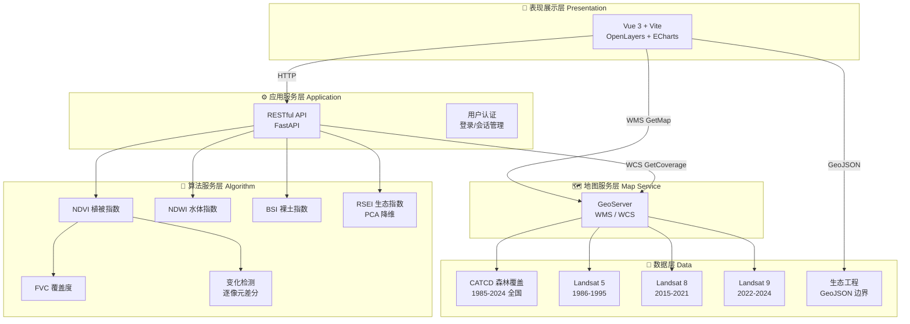

# 山河复翠：中国生态修复工程四十载时空演变地图平台

> 基于 WebGIS 的交互式在线叙事地图平台，以动态故事、地图探索与实时遥感分析三大篇章，直观呈现中国 1985–2024 年森林生态系统的时空演变历程。

**Landscape Revitalized: 40-Year Spatiotemporal Map Platform for China's Ecological Restoration Projects** — An interactive WebGIS-based story map platform that presents the spatiotemporal evolution of China's forest ecosystems (1985–2024) through dynamic narratives, map exploration, and real-time remote sensing analysis.

[](https://vuejs.org/)
[](https://vite.dev/)
[](https://openlayers.org/)
[](https://fastapi.tiangolo.com/)
[](https://www.python.org/)
[](https://geoserver.org/)
[](https://echarts.apache.org/)
[](https://landsat.gsfc.nasa.gov/)

---

## 技术栈 / Tech Stack

| 层级 Layer | 技术 Technology |
| ---------- | --------------- |
| 前端框架 Frontend | Vue 3 (Composition API) + Vite |
| 地图引擎 Map | OpenLayers 7 |
| 图表 Charts | ECharts 5 |
| 后端 Backend | FastAPI (Python) |
| 遥感处理 RS Processing | NumPy + Rasterio + PIL |
| 空间数据服务 Geo | GeoServer (WMS / WCS) |
| 数据源 Data | Landsat 5/8/9, CATCD 森林覆盖数据集 |

---

## 系统架构 / System Architecture



---

## 功能篇章 / Functional Chapters

### 登录页面 / Login Portal

> [!NOTE]
> **打字机过场动画**是本平台的标志性设计——登录后触发三段式叙事过渡：首段逐字打印中国森林生态成就数据，次段浮现习近平生态文明金句，末段呈现"进入平台"入口。全程支持空格键跳过，暗色毛玻璃背景叠加森林底图，营造沉浸式故事感。

The login portal features a signature **typewriter-style narrative transition**: after authentication, three sequential stages unfold — ecological achievement statistics typed line-by-line, a Xi Jinping quote on ecological civilization, and finally the platform entrance. Spacebar to skip. Dark glassmorphism backdrop over forest imagery creates an immersive storytelling atmosphere.

### 篇章〇 · 首页 / Chapter 0 · Home

> [!NOTE]
> 平台门户页面，左侧 45% 区域呈现深绿渐变遮罩 + 毛玻璃质感，承载项目标题"山河复翠"（渐变金绿大字）、副标题、项目背景与内容概述。右侧透出全幅卫星底图。底部附团队信息与审图号标注。

The landing page displays the project title "山河复翠" (Landscape Revitalized) in gradient gold-green typography, with project background and content overview on a dark gradient mask covering the left 45% of the viewport. The right side reveals the full satellite basemap.

### 篇章一 · 全国生态时空演变 (1985–2024) / Chapter 1 · National Forest Spatiotemporal Evolution

- 6 个标准年份（1985 / 1995 / 2000 / 2010 / 2014 / 2024）全国森林覆盖栅格 WMS 动态加载
- 前端 `postrender` 钩子实时 Gamma 拉伸 + 颜色渲染（灰度 → 绿米渐变）
- 四张 ECharts 动态图表：森林覆盖率折线图、蓄积量双轴柱状图、七区占比饼图、林种结构条形图
- 底部时间轴：节点切换 + 自动轮播，年份切换联动图表与地图图层

### 篇章二 · 重大生态工程 / Chapter 2 · Major Ecological Projects

- 四大工程边界矢量图层（三北防护林 / 天然林保护 / 退耕还林 / 退牧还草），填充图案与图例一致（斜线 / 十字网 / 横线 / 点阵）
- 地图交互点位：鼠标靠近触发工程名称提示 + 半透明背景渐显；点击展开简介卡片 → 跳转详情页
- 详情页：成效指标卡、里程碑时间轴、B 站纪实视频嵌入、实景照片自动轮播、立项背景 / 治理举措 / 空间跨度文字叙事

### 篇章三 · 区域遥感数据实时分析（库布齐沙漠） / Chapter 3 · Real-Time Remote Sensing Analysis (Kubuqi Desert)

- **遥感指数计算**：NDVI / FVC / NDWI / BSI / RSEI 五种生态指标，按选定年份一键计算
- **空间变化检测**：双时相 NDVI 逐像元差分，红-白-绿发散色带渲染
- **后端计算流水线**：GeoServer WCS 按需获取多波段影像 → NumPy 像元级运算 → 色带渲染 → PNG 返回前端叠加
- **分阶段进度动画**：图像调用 → 指数计算 → 专题图渲染，进度条均匀滚动
- **结果导出**：GeoTIFF（LZW 压缩）/ PNG 专题图（含色标图例）/ PDF 面积统计报告
- **内存缓存**：预览计算后缓存原始数据，重复导出零等待

---

## 项目结构 / Project Structure

```
ForestResourceSpatiotemporalStoryMap/
├── frontend/                       # Vue 3 前端
│   ├── src/
│   │   ├── App.vue                 # OpenLayers 地图、WMS 图层、颜色渲染
│   │   ├── components/
│   │   │   ├── Login.vue           # 登录页（打字机过场动画）
│   │   │   ├── ChapterHome.vue     # 篇章〇 · 首页
│   │   │   ├── ChapterOne.vue      # 篇章一 · 全国森林时空演变
│   │   │   ├── ChapterTwo.vue      # 篇章二 · 重大生态工程
│   │   │   ├── ChapterThree.vue    # 篇章三 · 遥感实时分析
│   │   │   └── DetailViewer.vue    # 工程详情页
│   │   ├── router/index.js
│   │   └── assets/data/            # 工程 JSON 数据
│   ├── public/
│   │   ├── images/ecoprojects/     # 工程实景图片
│   │   └── data/*.geojson          # 四大工程空间边界
│   └── vite.config.js
│
├── backend/                        # FastAPI 遥感分析后端
│   ├── main.py                     # API 入口 (20 个路由)
│   ├── config.py                   # 波段映射、WET 系数、GeoServer 配置
│   ├── cache.py                    # 内存缓存
│   ├── ndvi.py                     # NDVI 归一化植被指数
│   ├── fvc.py                      # FVC 植被覆盖度（百分位法）
│   ├── ndwi.py                     # NDWI 归一化水体指数
│   ├── bsi.py                      # BSI 裸土指数
│   ├── rsei.py                     # RSEI 遥感生态指数（PCA 降维）
│   ├── change_detection.py         # 双时相 NDVI 差分变化检测
│   ├── export_module.py            # GeoTIFF / PNG / PDF 导出
│   └── requirements.txt
│
└── 第二组-概要设计说明书V1.0.docx
```

---

## 开发环境要求 / Prerequisites

| 工具 Tool | 版本 Version |
| --------- | ------------ |
| Node.js | ≥ 18 |
| Python | ≥ 3.10 |
| GDAL | 系统库（rasterio 依赖） |

---

## 本地运行 / Local Development

### 前端 / Frontend

```bash
cd frontend
npm install
npm run dev
```

### 后端 / Backend

```bash
cd backend
pip install -r requirements.txt
python -m uvicorn main:app --host 0.0.0.0 --port 8000
```

> [!TIP]
> 开发环境下 Vite 代理将 `/api` 转发至 `localhost:8000`，`/geoserver` 转发至阿里云 GeoServer，从而绕过浏览器跨域限制。
>
> In development, Vite proxies `/api` → `localhost:8000` and `/geoserver` → Alibaba Cloud GeoServer, bypassing browser CORS restrictions.

---

## API 参考 / API Reference

| 方法 Method | 路径 Path | 说明 Description |
| ----------- | --------- | ---------------- |
| GET | `/api/health` | 健康检查 Health check |
| GET | `/api/bounds` | 库布齐研究区范围与可用年份 Study area bounds & available years |
| GET POST | `/api/{ndvi\|fvc\|ndwi\|bsi\|rsei}/{year}` | 单年遥感指数 (PNG + 地理边界头) Single-year index computation |
| GET | `/api/change/{year1}/{year2}` | 双时相 NDVI 差分 Bi-temporal NDVI change detection |
| GET | `/api/export` | 分析结果导出 (TIFF / PNG / PDF) Export analysis results |
| GET | `/api/info/{year}` | 年份卫星/波段信息 Satellite & band info for a year |

---

## 数据来源 / Data Sources

- 森林覆盖：CATCD 数据集，中国科学院空天信息创新研究院
- 库布齐多光谱：Landsat 5 TM (1986–1995) / Landsat 8 OLI (2015–2021) / Landsat 9 OLI-2 (2022–2024)
- 工程信息：《全国重要生态系统保护和修复重大工程总体规划 (2021–2035)》《中国森林资源报告》
